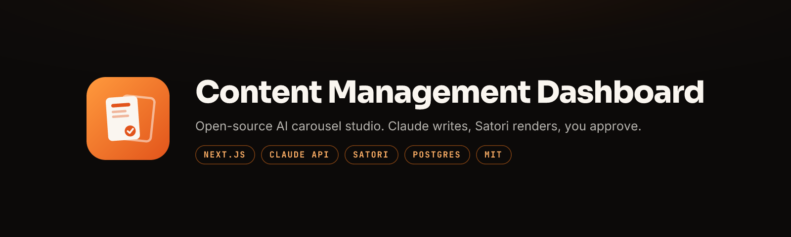
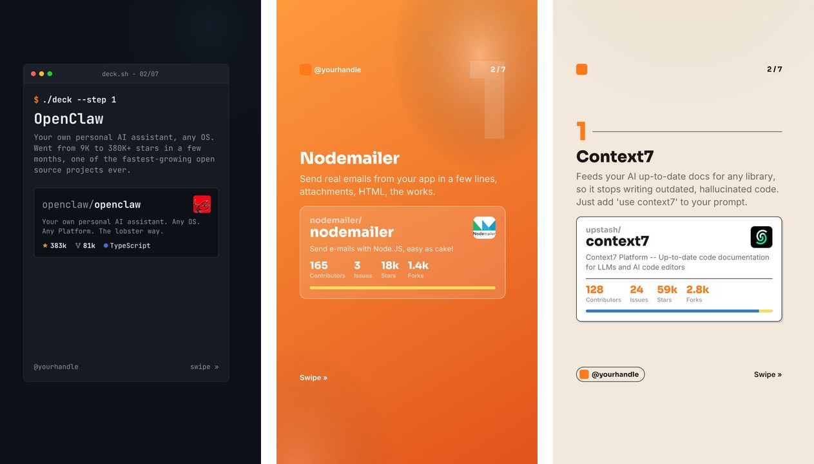
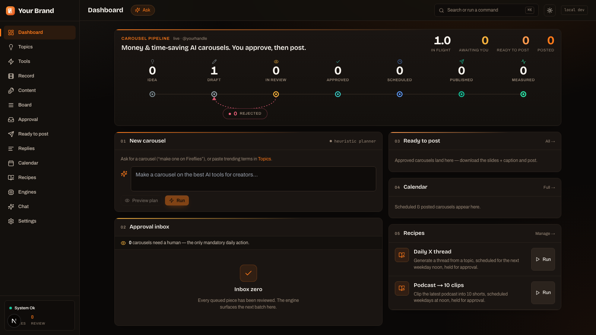
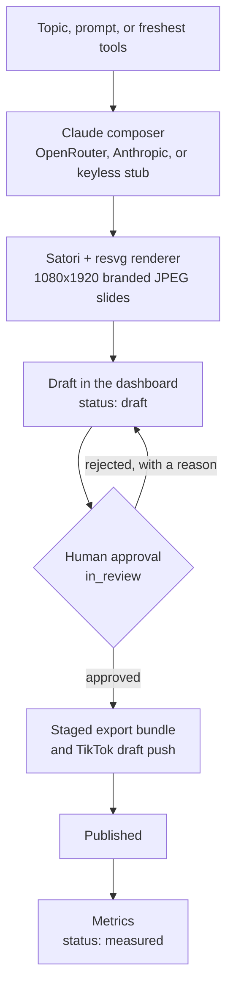
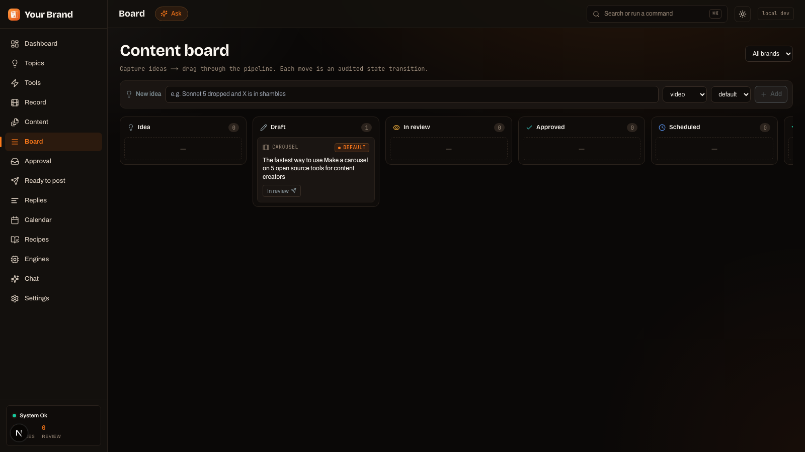
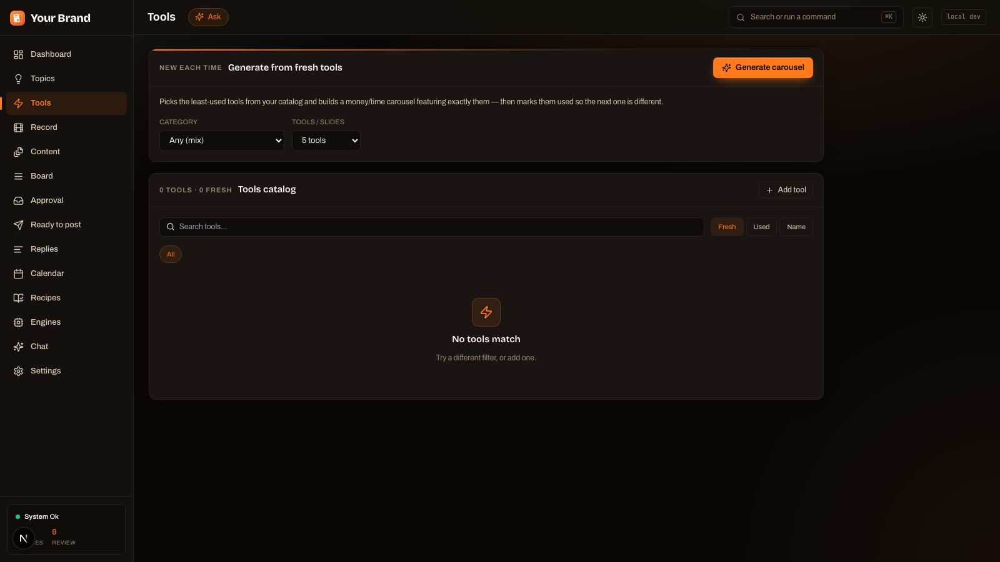

<div align="center">



# Content Management Dashboard

**Open-source AI carousel studio: Claude writes the copy, Satori renders branded slides, you approve every post.**

[](LICENSE)
[](https://nodejs.org)
[](https://pnpm.io)
[](https://nextjs.org)
[](CONTRIBUTING.md)

</div>

Content Management Dashboard is an open-source content management dashboard and AI
carousel generator for TikTok and Instagram. It is a self-hosted social media
content pipeline where Claude AI composes the slide copy in your brand voice,
Satori renders it as branded 1080x1920 image slides, and a human-in-the-loop
approval step signs off before anything reaches an audience. Type a topic or pick
your freshest tools, review the drafts in a Next.js dashboard, then push the deck
to your TikTok drafts or export a ready-to-post bundle. It runs with zero API keys
in a keyless local mode, so you can drive the whole pipeline end to end before you
wire up a model.

## See it in action

Real slides straight out of the renderer, one from each starter style
(terminal-dev, gradient-pop, paper-light), all with live GitHub repo cards
(stars, forks, language) and your handle stamped on every one.



The dashboard is where you compose, review, and approve. Nothing ships until a
human presses the button.



## How it works

One topic becomes a stack of branded slides, then waits in your approval inbox.
Every legal path from idea to published runs through review, so approval is
structural, not a convention.



Nothing reaches `published` without passing `in_review`. That rule is enforced in
the content state machine itself, so it is structurally true rather than a
convention. See [docs/ARCHITECTURE.md](docs/ARCHITECTURE.md).

## Features

- **AI carousel composition.** Claude turns a topic into a full deck: a hook
  slide, body slides, a CTA slide, plus caption and hashtags, validated and self
  correcting so the renderer always gets a well formed spec.
- **Branded slide renderer.** A Satori plus resvg engine renders 1080x1920 JPEG
  slides in multiple styles, with live GitHub repo cards from a `repo: "owner/name"`
  shorthand and an optional Higgsfield AI image background.
- **Multi-format rendering.** TikTok 9:16 (1080x1920), Instagram 4:5 (1080x1350),
  and square 2160x2160 X variants, all from one stored deck spec.
- **Human approval by design.** A content state machine forces every item through
  `in_review`, and rejection requires a reason that is fed back so the AI learns
  your taste.
- **Natural-language orchestrator.** A **Chat** console plans plain-English
  requests into queued drafts. Its tool catalog has no publish tool on purpose, so
  the most it can do is fill your review queue.
- **Recipes.** Saved one-click workflows (for example "podcast to 10 clips") that
  expand into a scheduled batch of drafts.
- **Comment reply drafting.** AI-drafted replies to comments on your posts, each
  human-reviewed before it is sent or copied.
- **Screen recorder studio.** A lightweight **Record** screen for capturing source
  footage.
- **Engine health.** An **Engines** screen showing each generation engine and its
  health, with automatic routing that skips down engines.
- **TikTok draft push.** Push an approved carousel to your TikTok drafts through
  the Content Posting API in draft/inbox mode, no app audit required.
- **X thread generation.** Operator scripts repurpose a carousel into X threads and
  single posts with square image variants.
- **Keyless stub mode.** With no AI key, a deterministic stub composes decks so the
  whole pipeline is testable end to end with zero spend.

## Quick start

Prerequisites: Node >= 20, pnpm 10.32.1 (via `corepack enable`), and Docker
Desktop for the local Postgres. Full walkthrough in [docs/SETUP.md](docs/SETUP.md).

```bash
pnpm install
cp .env.example .env         # works untouched, keyless local mode
pnpm db:up                   # Docker Postgres 17, host port 55433
pnpm db:migrate              # applies the init migration + generates the Prisma client
pnpm db:seed                 # loads 2 example recipes
pnpm dev                     # dashboard at http://localhost:3001
```

**Works with zero API keys.** With no AI key set, carousel composition falls back
to a deterministic stub deck, so the whole pipeline is testable end to end without
any account or API key.

Render a carousel from a JSON deck, straight to disk:

```bash
pnpm tsx scripts/render-carousel.mts scripts/decks/github-trending-1.json output/github-trending-1
```

`pnpm tsx` is a root script that loads the root `.env` and runs `tsx` inside the
control-plane app, so paths are relative to `apps/control-plane` (the slides land
in `apps/control-plane/output/github-trending-1`).

## Connect your AI

Set one environment variable and the AI features light up. `OPENROUTER_API_KEY` is
preferred (it powers both the composer and the chat planner), `ANTHROPIC_API_KEY`
calls Anthropic directly for the composer. Models are configurable with
`ORCHESTRATOR_MODEL` (an OpenRouter slug, default `anthropic/claude-sonnet-5`) and
`ANTHROPIC_MODEL` (default `claude-sonnet-5`).

Full provider chain, model config, and the no-publish safety design:
[docs/connect-your-agent.md](docs/connect-your-agent.md).

## Make it yours

Every brand value (handle, display name, links, CTA, accent colors, and the AI
voice persona) is a `BRAND_*` env var with a neutral placeholder default, so a
fresh clone renders and composes out of the box; set them to your real handles for
a live deployment. Once your colors are set, regenerate the whole visual identity
(logo mark, README banner, social preview, favicons) with the same engine that
renders your slides:

```bash
pnpm tsx ../../packages/carousel-render/scripts/render-brand-assets.mts
```

Details, plus the two logo placeholders you swap for your own, are in
[docs/branding.md](docs/branding.md).

## More screenshots

<details>
<summary>Kanban board and AI tools catalog</summary>

<br />





</details>

## FAQ

**How do I make TikTok carousels with AI?**
Install the dashboard, type a topic (or pick your freshest tools), and Claude
composes the slide copy while Satori renders branded 9:16 image slides. You review
the draft, approve it, then push it to your TikTok drafts or export a ready-to-post
bundle. The full walkthrough is in [docs/SETUP.md](docs/SETUP.md).

**Can I run this without any API keys?**
Yes. In keyless local mode the composer falls back to a deterministic stub, so you
can install, browse the dashboard, generate placeholder decks, and run the smoke
tests offline with no key and no spend. Add an AI key later for real brand-voice
copy.

**Does it post to TikTok automatically?**
Not fully. Approved carousels are pushed to your TikTok drafts/inbox through the
Content Posting API, and you tap Post in the app. That draft mode needs no TikTok
app audit. It does require the slides to be served from a public HTTPS host you
have verified, so localhost will not work for the push. Fully automatic direct
posting is possible later, after a TikTok app audit. See
[docs/tiktok-auto-post.md](docs/tiktok-auto-post.md).

**Can I use my own brand colors and fonts?**
Yes. Handle, display name, links, CTA, accent colors, and the AI voice persona are
all `BRAND_*` env vars. The `render-brand-assets` script regenerates your logo,
banner, and social preview from those colors, and the fonts and logo assets in
`packages/brand` and `apps/control-plane/public/logo.png` are yours to swap. See
[docs/branding.md](docs/branding.md).

**What AI models does it use?**
The provider chain is OpenRouter first, then the Anthropic API, then the keyless
stub. Defaults are `anthropic/claude-sonnet-5` (as an OpenRouter slug) for the
composer and chat planner, and `claude-sonnet-5` on the direct Anthropic path. Any
OpenRouter model works: point `ORCHESTRATOR_MODEL` at it. Details in
[docs/connect-your-agent.md](docs/connect-your-agent.md).

**Is my content reviewed before it goes public?**
Always. The content state machine routes every item through `in_review`, rejection
requires a reason, and the natural-language orchestrator has no publish tool by
design. The most any AI here can do is fill your approval inbox with drafts; a
human approves anything that ships.

**Do I have to self-host a publishing stack?**
No. The compose, approve, and export flow works on its own, and the TikTok draft
push needs no extra services. Fully automated multi-platform publishing is optional
and layers Postiz and n8n on top when you want it. See
[docs/deployment.md](docs/deployment.md).

## Architecture

A pnpm plus Turbo monorepo: one Next.js 15 app (`apps/control-plane`) is the
dashboard, the API, and the glue, sitting on a set of scoped `@cmd/*` packages
(contracts, db, brand, carousel-render, generation, integrations, orchestrator)
over a Postgres control-plane spine. The behavioral source of truth is the state
machine and event vocabulary in `packages/contracts`. Full map, data model, and
integration points in [docs/ARCHITECTURE.md](docs/ARCHITECTURE.md).

## Documentation

| Doc | What it covers |
|---|---|
| [docs/SETUP.md](docs/SETUP.md) | From-zero local setup and your first carousel. |
| [docs/ARCHITECTURE.md](docs/ARCHITECTURE.md) | The monorepo, state machine, data model, and integration points. |
| [docs/connect-your-agent.md](docs/connect-your-agent.md) | Connect Claude or OpenRouter, model config, and the no-publish safety design. |
| [docs/branding.md](docs/branding.md) | Brand env vars, logo assets, and regenerating your visual identity. |
| [docs/scripts.md](docs/scripts.md) | The operator scripts: render, register, threads, seed, smoke tests. |
| [docs/deployment.md](docs/deployment.md) | Production deployment on Railway or Vercel, plus optional Postiz and n8n. |
| [docs/tiktok-auto-post.md](docs/tiktok-auto-post.md) | Push approved carousels to TikTok drafts. |
| [apps/control-plane/scripts/decks/README.md](apps/control-plane/scripts/decks/README.md) | The deck JSON format and example decks. |

The full index with one-line descriptions lives in [docs/README.md](docs/README.md).

## Limitations

Stated honestly, so there are no surprises:

- **Instagram comment replies are not implemented.** Reply drafting is
  TikTok-oriented, and sends are manual copy (paste the drafted reply yourself).
- **Publishing automation is optional and self-hosted.** Fully automated
  multi-platform publishing requires you to self-host Postiz and n8n. Without them
  you still get the full compose, approve, and export flow.
- **TikTok posting uses draft/inbox mode.** Approved carousels are pushed to your
  TikTok drafts, where you tap Post. Direct publishing depends on TikTok app
  approval settings.
- **Higgsfield AI backgrounds are optional.** Without `HIGGSFIELD_API_URL`, slides
  render over the brand gradient instead of an AI image.
- **Keyless mode uses a stub composer.** With no AI key, slide copy comes from a
  deterministic stub. Set an AI key for real brand-voice copy.

> **Warning:** never deploy with `NEXT_PUBLIC_DISABLE_AUTH="true"`. The dashboard
> has no other gate in front of it, so a deployed instance with auth disabled is
> open to anyone. Set the Clerk keys and remove the flag before you deploy. See
> [docs/deployment.md](docs/deployment.md).

## Contributing

Contributions are welcome. Start with [CONTRIBUTING.md](CONTRIBUTING.md), and keep
the safety gate intact: do not add anything that publishes, sends, deletes, or
spends without a human approval step.

## License

MIT. See [LICENSE](LICENSE).
