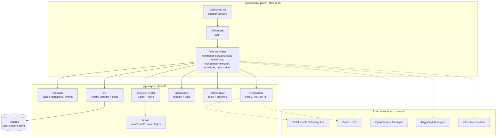

# Architecture

This document maps the monorepo, the content state machine, how a carousel is
generated, the orchestrator design, the database schema, and the integration
points. It is meant to be read alongside the code, which it links to.

## Components at a glance

One Next.js app holds the dashboard, the API, and the first-party glue. It sits on
a set of scoped `@cmd/*` packages and a Postgres control-plane spine, and reaches
out to a handful of external services, all of which are optional.



Solid arrows are always-on internal wiring; dotted arrows are outbound calls to
external services that activate only when their env vars are set. Each piece is
detailed below.

## The monorepo

A pnpm 10.32.1 workspace driven by Turbo, Node >= 20. One app and a set of
scoped `@cmd/*` packages.

```
apps/
  control-plane/     Next.js 15 dashboard + API + first-party glue
packages/
  contracts/         the shared contract (states, transitions, events)
  db/                Prisma schema + client (Postgres, the spine)
  brand/             brand identity: colors, fonts, voice, copy, logos
  carousel-render/   Satori/resvg renderer -> 1080x1920 JPEG slides
  generation/        generator abstraction + registry + stub engine
  integrations/      outbound clients: Postiz, n8n, TikTok
  orchestrator/      intent/planning layer (tools catalog, planners)
```

### apps/control-plane

The Next.js app is both the dashboard UI (the sidebar screens) and the API
(`src/app/api/*`). It also holds the first-party glue that wires the packages
together: the carousel composer, the generation service, the content service and
state-transition logic, the publish and staging services, the scheduler, the
transactional-outbox drain, the orchestrator executor and planner, comment-reply
drafting, the TikTok service, and the GitHub card fetcher. It is the only place
that reads secrets, through `apps/control-plane/src/lib/env.ts`.

### packages/contracts

The behavioral source of truth. It defines the content lifecycle states
(`content-status.ts`), the legal transition graph and its guards
(`state-machine.ts`), and the shared event vocabulary (`events.ts`). It also
declares the brand surfaces (this fork ships a single `default` surface) and the
content types (`tweet`, `thread`, `clip`, `carousel`, `video`, `post`). No service
reaches into another's database; they coordinate through these types and events.

### packages/db

The Prisma schema and generated client for the control-plane Postgres. This DB is
a thin control plane that sits on top of Postiz: Postiz owns its own publishing
state in its own database, while this one owns the full lifecycle (idea to
measured) and the orchestration state. Keeping the custom logic here, out of the
forked Postiz codebase, is what keeps Postiz upgrades painless. The `ContentStatus`
enum mirrors `@cmd/contracts`; contracts remains the source of truth for
transitions and this enum is the storage representation.

### packages/brand

The single source of truth for brand identity, consumed by both the renderer and
the AI composer: handle, display name, links, CTA copy, accent colors, fonts,
logos, and the composer voice persona. Every value is configurable through
`BRAND_*` env vars with neutral placeholder defaults, so a fresh clone renders and
composes without any brand setup.

### packages/carousel-render

The Satori plus resvg rendering engine. It holds the slide templates (editorial,
gradient-pop, paper-light, and terminal-dev), font loading, the logo asset, the type definitions for
a `CarouselSpec` and its slides, and the storage layer that writes rendered slides
to local disk or Vercel Blob. Output is 1080x1920 JPEG, the size and format
TikTok's photo API accepts.

### packages/generation

The generator abstraction: a `GeneratorRegistry` that routes a brief to a
`Generator`, a `StubGenerator` that always works so dev and CI can exercise the
full pipeline, schedule-policy helpers, and the shared brief and asset types. The
control plane registers the real engines (the carousel composer, HTTP clipper, and
Higgsfield) on top of this.

### packages/integrations

Outbound integration clients kept free of app logic: the Postiz publishing client,
the n8n webhook client, and the TikTok Content Posting API client.

### packages/orchestrator

The intent and planning layer. It defines the orchestrator's tool catalog
(`tools.ts`), a heuristic planner and a Claude request mapper, and the plan and
tool-call types. The catalog has exactly two tools and, deliberately, no publish
tool (see below).

## The content state machine

Every piece of content is one `ContentItem` record moving through a fixed set of
states. The states and the legal transitions between them are defined in
`packages/contracts/src/content-status.ts` and
`packages/contracts/src/state-machine.ts`.

States: `idea`, `draft`, `in_review`, `approved`, `scheduled`, `published`,
`measured`, `rejected`.

Legal transitions:

```
  idea -> draft -> in_review -> approved -> scheduled -> published -> measured
                       \-> rejected (carries a reason) -> draft
```

The control plane refuses any transition the graph does not encode. Two guards
make the design structural rather than aspirational:

- **Reason required.** Moving an item to `rejected` requires a non-empty reason.
  It is stored on the item and carried back so the AI can learn the brand's taste.
- **Review is unavoidable.** Every path from `idea` to `published` passes through
  `in_review`. The package proves this from the graph itself
  (`everyPathToPublishedPassesReview`), so approval cannot be skipped.

Some transitions emit an event for downstream services (`events.ts`): reaching
`approved` emits `content.approved`, and reaching `published` emits
`content.published`. Not every transition is externally interesting, so only these
are mapped.

## Request flow: generating a carousel

From a topic in the UI to a draft in the approval inbox.

```
1. UI            Topics or Tools page POSTs a brief.
                 Topics  -> POST /api/generate        { type: "carousel", prompt }
                 Tools   -> POST /api/tools/generate  { count, category? }

2. Generation    runGeneration() asks the GeneratorRegistry to select an engine.
   service       The CarouselComposer is registered first, so carousel briefs
                 route to it ahead of Higgsfield and the stub.

3. Compose       The composer writes the slide deck (hook, body, CTA slides, plus
                 caption and hashtags) via the AI provider chain:
                 OpenRouter -> Anthropic -> deterministic stub.

4. Background    A BackgroundProvider supplies each slide's backdrop: a Higgsfield
                 AI image when configured, otherwise the brand gradient.

5. Render        renderCarousel() (Satori + resvg, @cmd/carousel-render) produces
                 N x 1080x1920 JPEG slides.

6. Store         Slides are written to disk (public/carousels/<id>, served at
                 /carousels/...) or to Vercel Blob when BLOB_READ_WRITE_TOKEN is
                 set.

7. Persist       createContent() saves a ContentItem with type=carousel,
                 status=draft, and the slide URLs in assetUrls. A StateTransition
                 row and a content.created OutboxEvent are written in the same
                 transaction.

8. Drain         drainOutbox() delivers the event to consumers (n8n, future
                 services).

9. Approve       The draft appears in the Approval inbox. A human approves it via
                 POST /api/content/[id]/transition, moving it through in_review to
                 approved. On approval a carousel is exported as a ready-to-post
                 bundle and shown under Ready to post.
```

## The orchestrator

The natural-language console (the **Chat** screen) turns a plain-English request
into queued drafts. `POST /api/orchestrate` sends the request to a planner: the
OpenRouter planner when a key is set, otherwise a deterministic heuristic planner.
The planner returns an `OrchestrationPlan`, a list of tool calls drawn from the
catalog in `packages/orchestrator/src/tools.ts`:

- `generate_content` generate one or more items from a brief; the results are
  drafts held for approval.
- `run_recipe` run a saved recipe (a named workflow that generates a scheduled
  batch of drafts).

`executePlan` (`apps/control-plane/src/lib/orchestrator/executor.ts`) maps each
call onto `runGeneration` or `runRecipe`. Every run is logged as an
`OrchestrationRun` row with the plan and the ids of the items it created.

**The no-publish guarantee.** The catalog has no publish tool, on purpose. The
orchestrator can make and queue content but cannot push anything public; a human
still approves everything through the same state machine. This is the review rule
holding even when the brain is driving.

## Database schema

Defined in `packages/db/prisma/schema.prisma`. The core models:

- **ContentItem** one piece of content as a single record moving through the state
  machine. Holds type, brand surface, title, a free-form `payload`, the generated
  `assetUrls`, status, an optional `rejectionReason`, the `postizPostId` once
  published, and the scheduled/published/measured timestamps.
- **StateTransition** an append-only audit log of every state change (from, to,
  actor, optional reason, timestamp).
- **OutboxEvent** the transactional outbox. Events are written in the same
  transaction as the state change, then drained to consumers, which guarantees an
  event is emitted if and only if the change committed. Carries retry bookkeeping
  (attempts, last error, processed-at).
- **Metric** normalized performance metrics pulled back from analytics, closing
  the loop from published to measured (platform, key, value, captured-at).
- **Recipe** a saved one-click workflow: a brief template plus count plus a
  schedule policy that expands into a batch of drafts. Seeded with two examples.
- **OrchestrationRun** the audit log of orchestrator runs, one row per request,
  with the full plan and the ids of items it created.
- **CommentReply** an AI-drafted reply to a comment on a published post, matched
  to the post's ContentItem. Every reply is human-reviewed before it is sent or
  copied. `externalId` supports a future Instagram auto-reply path; it is null for
  the manual paste flow.
- **AiTool** the catalog of AI tools the composer draws from, with rotation
  bookkeeping (`useCount`, `lastUsedAt`) so the picker surfaces the freshest tools
  and keeps content novel.
- **TikTokConnection** a connected TikTok account (Login Kit OAuth tokens) used to
  push carousels to the creator's drafts via the Content Posting API. Usually one
  row.

## Integration points

- **Postiz** (`packages/integrations/src/postiz.ts`) the publishing client for
  connected channels. Publishing resolves an item to its brand's channels via
  `POSTIZ_CHANNELS_<BRAND>`; it refuses to publish rather than guess if no target
  is configured, so one brand's content can never land on another's accounts.
  Optional and off by default (`AUTO_PUBLISH=false`).
- **n8n** (`packages/integrations/src/n8n.ts`) the automation backbone that
  consumes drained outbox events at `N8N_WEBHOOK_BASE_URL` and drives the Postiz
  publish step. Optional and self-hosted.
- **TikTok** (`packages/integrations/src/tiktok.ts`, `src/lib/tiktok-service.ts`,
  and the `/api/tiktok/*` and `/api/content/[id]/push-tiktok` routes) the Content
  Posting API in draft/inbox mode. TikTok fetches the slide images from
  `PUBLIC_BASE_URL`, which must be a public, URL-verified HTTPS host, so localhost
  will not work for the push. See [tiktok-auto-post.md](tiktok-auto-post.md).
- **GitHub cards** (`apps/control-plane/src/lib/github-card.ts`) a slide can carry
  a `repo: "owner/name"` shorthand that is expanded into a live GitHub card on the
  slide. `GITHUB_TOKEN` is optional and only raises the API rate limit.
- **Higgsfield** (`src/lib/generators/http-generators.ts`) an optional AI image
  backend for slide backgrounds. Without `HIGGSFIELD_API_URL` the renderer falls
  back to the brand gradient.

For connecting an external agent to the orchestrator, see
[connect-your-agent.md](connect-your-agent.md). For the operator scripts, see
[scripts.md](scripts.md).

---

[Docs index](README.md) · [Project README](../README.md)
